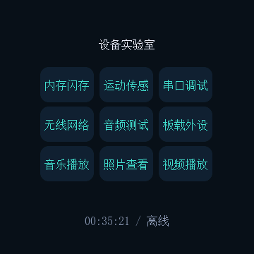

# WU ESP32-S3 Touch LCD 1.85 圆屏设备实验室

面向微雪 `ESP32-S3-Touch-LCD-1.85` 的 ESP-IDF + LVGL 综合示例。项目把板载外设、深色中文圆屏 UI、音乐播放、SD 卡照片/视频、串口、Wi-Fi、触摸校准和诊断命令整合到一个可编译工程中。



> 项目在 360×360 圆形屏上开发。截图来自 LVGL 帧缓冲回传，真实屏幕颜色、触摸手感和扬声器音量仍与具体硬件有关。

## 功能

- 首页设备实验室：Flash、PSRAM、内部堆、RTC、电池、SD 卡和运行状态。
- QMI8658 加速度/陀螺仪实时数值和曲线。
- UART1 调试：TX GPIO43、RX GPIO44，8N1，多档波特率、文本/十六进制和回环测试。
- Wi-Fi 扫描与连接；密码只保存在运行时内存，不写入 NVS。
- I2S 麦克风动态电平、波形和测试音；PCM5101 扬声器输出。
- SD 音乐播放器：MP3/FLAC，列表、暂停、切歌、音量和外部按键。
- SD 照片查看：JPG、PNG、普通 BMP，按比例裁切到全屏；首次读取可生成 RGB565 缓存。
- SD 视频播放：MJPEG AVI 和裸 MJPEG；AVI 支持 16-bit PCM 音频。MP4/H.264 通过主机端 FFmpeg 转换为屏幕适用副本。
- 中文字体子集、返回键、横向滑动切换和触摸五点校准。

## 快速开始

### 环境

1. 安装 ESP-IDF 5.5.5、Python 3.11 和 Git。
2. 安装 LVGL 8.3.11、`chmorgan/esp-audio-player`、`chmorgan/esp-libhelix-mp3`、`espressif/esp-sr`。依赖版本见 `firmware/dependencies.lock`。
3. Windows 可在 ESP-IDF PowerShell 中进入 `firmware`；Linux/macOS 使用已执行 `export.sh` 的终端。

```powershell
cd firmware
idf.py set-target esp32s3
idf.py build
idf.py -p COM4 flash monitor
```

也可以使用仓库内的 `firmware/device_lab.ps1 -Action build`、`-Action app-flash -Port COM4`。首次编译需要联网下载组件。不要提交 `build/`、`managed_components/` 或 `sdkconfig.old`。

### 字体

仓库内的 `assets/fonts/NotoSansCJKsc-Regular.otf` 采用 SIL OFL 1.1。若新增界面文字，修改 `firmware/main` 中的文本后运行：

```powershell
python tools/gen_font.py --converter PATH_TO_lv_font_conv.js
```

生成的 `font_music_cjk.c` 是可直接编译的中文子集。不要把私人歌名、SSID 或照片文件名放进提交。

## 硬件连接

详细资料在 `hardware/ESP32-S3-Touch-LCD-1.85.pdf`，引脚图在 `hardware/`。本工程使用：

| 模块 | 引脚 |
|---|---|
| LCD SPI | SCK 40，D0 46，D1 45，D2 42，D3 41，CS 21，TE 18，背光 5 |
| Touch CST816 | SDA 1，SCL 3，INT 4，复位由扩展 IO 控制 |
| I2C/QMI8658/RTC | SDA 11，SCL 10 |
| SD 1-bit | CLK 14，CMD 17，D0 16 |
| UART1 | TX 43，RX 44 |
| 麦克风 I2S | WS 2，BCK 15，DIN 39 |
| PCM5101 | DIN 47，LRCK 38，BCK 48 |
| 按键 | GPIO0 页面切换，GPIO12 上一首/前项，GPIO13 下一首/后项 |

GPIO43/44 是 3.3V UART，外接设备需要 TX/RX 交叉并共地。不要把 5V TTL 直接接入。

## SD 媒体

播放器不会修改原始文件。照片缓存位于 `/sdcard/.lab_media_cache`；转换副本位于 `/sdcard/device_lab_media`。

```powershell
# 先在电脑上转换，原文件保持不变
python firmware/media_convert.py .\media --recursive --output .\converted --fps 12

# 通过 USB 逐块 CRC 校验上传单个副本
python firmware/media_upload.py .\converted\clip.mp4.screen.avi --port COM4

# 让固件将 SD 上的原始 MP4 下载、转换并上传副本
python firmware/media_sd_convert.py --all --port COM4

# 为照片建立缓存
python firmware/media_prepare.py
```

MJPEG 视频建议 360×360、5–12 fps、AVI 容器；音频会转成 16 kHz 单声道 PCM。ESP32-S3 不直接解码 H.264/H.265。大视频库使用读卡器运行 `media_convert.py` 更快。

## USB 诊断命令

固件的 USB Serial/JTAG 控制台支持 `status`、`page 0..9`、`audit`、`shot`、`touch-stats`、`touch-cal`、`scan`、`media-scan`、`media-status`、`media-prepare`、`media-open N`、`media-next +/-1`、`media-toggle` 和 `media-back`。发送 `help` 或查看 `firmware/main/Hardware_Test/Test_UI.c` 可获得完整分支。

## 测试

```powershell
python firmware/verify_media.py
python firmware/verify_touch.py
python firmware/verify_round_ui.py
```

测试截图和日志不放入公开仓库；发布包中的 `docs/images/` 只保留脱敏的 UI、测试图和视频状态示例。

## 目录

- `firmware/`：可编译 ESP-IDF 工程及主机端媒体工具。
- `hardware/`：微雪公开硬件 PDF、引脚图和板级连接图。
- `references/waveshare-demo/`：从本地资料整理的官方示例源码片段和来源清单。
- `assets/fonts/`：可再分发的 Noto Sans CJK 字体和许可证。
- `docs/images/`：公开示例截图。

## 许可证与第三方声明

本项目新增代码按 MIT 许可证发布；第三方组件继续遵循各自许可证。`references/source-manifest.json` 记录本地资料的来源和 SHA-256。LVGL、ESP-IDF、minimp3、dr_flac、TJpgDec、LodePNG、ESP Audio Player、Helix MP3、ESP-SR 和 Noto Sans CJK 的许可证不可由本项目许可证替代。

## 隐私与安全

仓库不包含 Wi-Fi 密码、GitHub token、串口完整日志、SD 原始照片/视频、设备 MAC、Windows 用户目录或私有歌单。发现问题请阅读 `SECURITY.md`，不要公开上传凭据或完整设备日志。
